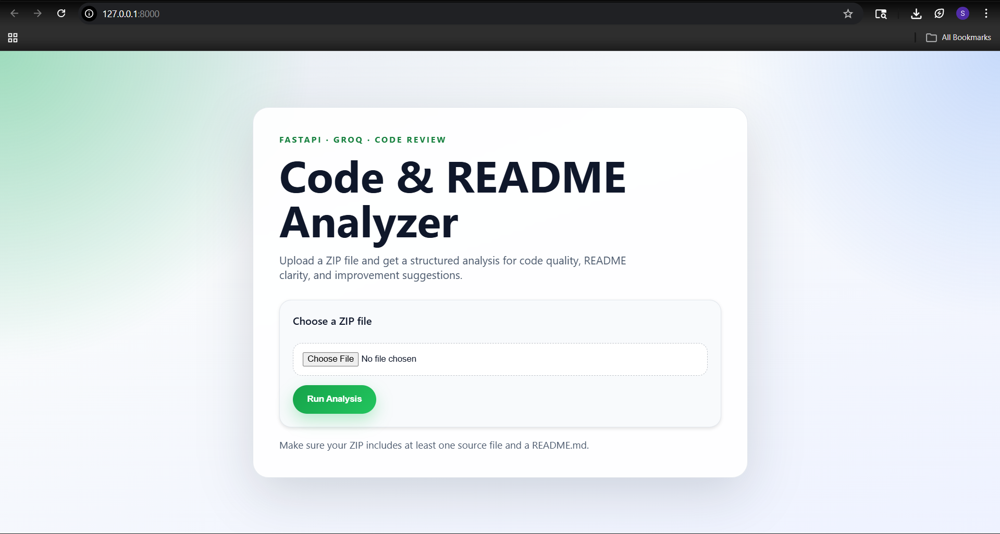
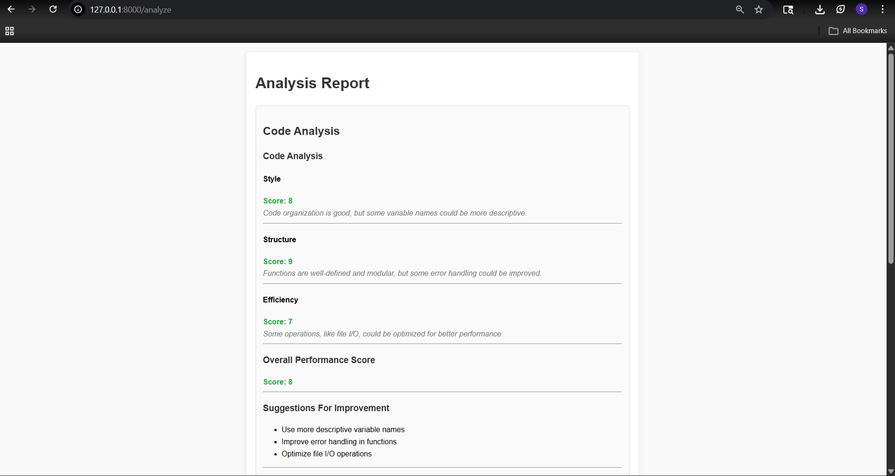
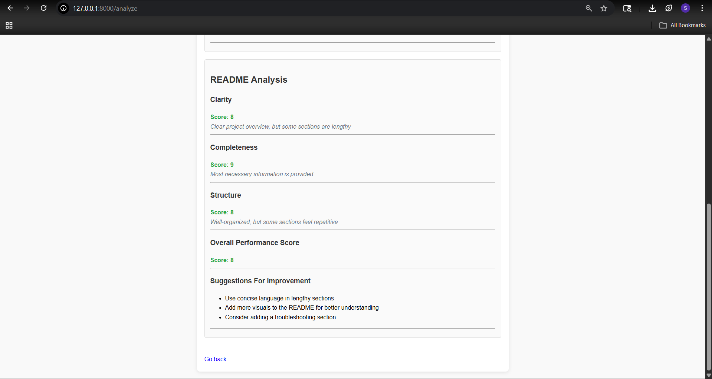

# FastAPI Code & Documentation Analyzer with Groq API

## Overview

This is a powerful FastAPI application that analyzes code quality and README documentation using the **Groq API** (powered by Meta's Llama 3.3 70B model). Upload a ZIP file containing your project, and the application will evaluate your code structure, style, and efficiency, as well as assess your README's clarity and completeness. The results are displayed in an interactive HTML report with detailed scoring and feedback.

## Table of Contents

- [Features](#features)
- [Requirements](#requirements)
- [Installation](#installation)
- [Configuration](#configuration)
- [Usage](#usage)
- [Project Structure](#project-structure)
- [How It Works](#how-it-works)
- [Code Analysis](#code-analysis)
- [README Analysis](#readme-analysis)
- [Troubleshooting](#troubleshooting)
- [Contributing](#contributing)
- [Screenshots](#screenshots)

## Features

✨ **Code Analysis**
- Evaluates code style, structure, and efficiency
- Provides actionable feedback and improvement suggestions
- Analyzes multiple file types (.py, .js, .java, etc.)
- JSON-formatted responses from Groq API

✨ **README Analysis**
- Assesses documentation clarity, completeness, and structure
- Identifies missing sections and improvement areas
- Provides scoring and detailed recommendations

✨ **Modern Web Interface**
- Clean, professional landing page with drag-and-drop upload
- Beautiful report rendering with responsive design
- Real-time feedback during analysis
- HTML-escaped output for security

✨ **Safe File Handling**
- Secure ZIP extraction with path traversal protection
- Automatic temporary file cleanup
- Support for nested project structures

## Requirements

- **Python**: Version 3.8 or higher
- **Groq API Key**: Free or paid account at [console.groq.com](https://console.groq.com)
- **FastAPI**: Web framework
- **Uvicorn**: ASGI server
- **OpenAI Python SDK**: For Groq API integration (OpenAI-compatible)

## Installation

### 1. Clone the Repository

```bash
git clone https://github.com/anou1234/Fastapi_code_docu_analyzer.git
cd Fastapi_code_docu_analyzer
```

### 2. Set up a Virtual Environment

**On Windows:**
```bash
python -m venv venv
venv\Scripts\activate
```

**On macOS/Linux:**
```bash
python3 -m venv venv
source venv/bin/activate
```

### 3. Install Dependencies

```bash
pip install -r requirements.txt
```

The following packages will be installed:
- `fastapi` - Web framework
- `uvicorn` - ASGI server
- `openai` - Groq API client (OpenAI-compatible)
- `python-dotenv` - Environment variable management
- `python-multipart` - File upload handling

## Configuration

### 1. Get Your Groq API Key

1. Visit [console.groq.com](https://console.groq.com)
2. Sign up or log in to your account
3. Navigate to **API Keys** in the dashboard
4. Create a new API key and copy it

### 2. Set Up Environment Variables

In the `project/` directory, copy the example file and add your credentials:

```bash
# Windows
copy project\.env.example project\.env

# macOS/Linux
cp project/.env.example project/.env
```

Edit `project/.env` and add your Groq API key:

```env
GROQ_API_KEY=gsk_your_api_key_here
GROQ_MODEL=llama-3.3-70b-versatile
GROQ_BASE_URL=https://api.groq.com/openai/v1
```

**⚠️ Security Note**: Never commit `.env` to version control. The `.env` file is listed in `.gitignore` for your safety.

## Usage

### 1. Start the Application

```bash
cd project
python -m uvicorn main:app --reload
```

You should see output like:
```
Uvicorn running on http://127.0.0.1:8000
```

### 2. Access the Web Interface

Open your browser and navigate to:
```
http://127.0.0.1:8000
```

### 3. Upload and Analyze

1. Click the upload area or drag a ZIP file onto the page
2. The ZIP should contain:
   - At least one source code file (`.py`, `.js`, `.java`, etc.)
   - A `README.md` file (optional but recommended)
3. Click **Analyze** and wait for the report

### 4. Review the Report

The generated report includes:
- **Overall Scores**: Code and README ratings (0-10)
- **Detailed Feedback**: Specific strengths and areas for improvement
- **Suggestions**: Actionable recommendations for enhancement

## Project Structure

```
Fastapi_code_docu_analyzer/
├── README.md                          # This file
├── requirements.txt                   # Python dependencies
├── project/
│   ├── main.py                        # FastAPI app & routing
│   ├── analyze_code.py                # Groq API integration
│   ├── .env                           # Environment variables (create from .env.example)
│   ├── .env.example                   # Example configuration
│   ├── static/
│   │   └── style.css                  # Web interface styling
│   ├── uploads/                       # Temporary upload storage
│   └── test/                          # Sample test data
├── images/                            # Screenshot storage
│   ├── screenshot1.png
│   ├── screenshot2.png
│   └── screenshot3.png
```

## How It Works

### Backend Flow

1. **User Upload**: ZIP file is received via `/analyze` endpoint
2. **Safe Extraction**: ZIP is extracted with path traversal protection
3. **File Detection**: System identifies first code file and README
4. **Groq API Call**: Code and README are sent to Groq API with JSON-constrained prompts
5. **JSON Parsing**: Groq responses are validated and parsed (with fallback handling)
6. **Report Generation**: Results are rendered as an interactive HTML report
7. **Cleanup**: Temporary files are automatically removed

### Technology Stack

- **Backend**: FastAPI (async Python web framework)
- **AI Model**: Groq API with Meta Llama 3.3 70B (optimized for JSON output)
- **Frontend**: HTML5, CSS3, vanilla JavaScript
- **API Format**: OpenAI-compatible REST API

## Code Analysis

The application evaluates code across multiple dimensions:

| Metric | Description |
|--------|-------------|
| **Style** | Consistency with best practices, naming conventions, formatting |
| **Structure** | Organization, modularity, separation of concerns |
| **Efficiency** | Performance considerations, algorithmic complexity, resource usage |

Each dimension receives a score (0-10) with detailed feedback and actionable suggestions.

## README Analysis

Documentation quality is assessed on:

| Metric | Description |
|--------|-------------|
| **Clarity** | How clearly the project purpose and usage are explained |
| **Completeness** | Coverage of installation, usage, dependencies, contribution guidelines |
| **Structure** | Proper formatting, organization, and navigation |

## Troubleshooting

### "GROQ_API_KEY is not set"

**Solution**: Ensure your `.env` file is in the `project/` directory with a valid key:
```bash
# Verify the file exists
ls project/.env           # macOS/Linux
dir project\.env          # Windows

# Check that the key is not blank
cat project/.env
```

### Rate Limit Errors from Groq

**Solution**: You may have hit the API rate limit. Wait a few moments before trying again, or upgrade your Groq account for higher limits.

### "Bad request" / JSON Validation Errors

**Solution**: Simplify your project structure:
- Include one `.py` or `.js` file (not a complex monorepo)
- Include a `README.md` with basic markdown
- Avoid very large files or unusual character encodings

### Port 8000 Already in Use

**Solution**: Use a different port:
```bash
python -m uvicorn main:app --reload --port 8001
```

### ZIP File Not Extracting

**Solution**: Ensure:
- The ZIP is not corrupted
- The ZIP is not password-protected
- The ZIP is a valid archive (try opening it with your file explorer)

## Contributing

Contributions are welcome! Please follow these steps:

1. **Fork the Repository** on GitHub
2. **Create a Feature Branch**: `git checkout -b feature/your-feature`
3. **Make Your Changes**: Implement your improvements
4. **Test Your Changes**: Ensure the app still runs without errors
5. **Commit**: `git commit -m "Add your feature description"`
6. **Push**: `git push origin feature/your-feature`
7. **Submit a Pull Request** on GitHub

## License

This project is provided as-is for educational and development purposes.

## Support & Feedback

- **Issues**: Found a bug? [Open an issue on GitHub](https://github.com/anou1234/Fastapi_code_docu_analyzer/issues)
- **Questions**: Check existing issues or create a new discussion
- **Feedback**: We'd love to hear how you're using this tool!

---

## Screenshots

### Landing Page


### Analysis Report


### Results Dashboard


